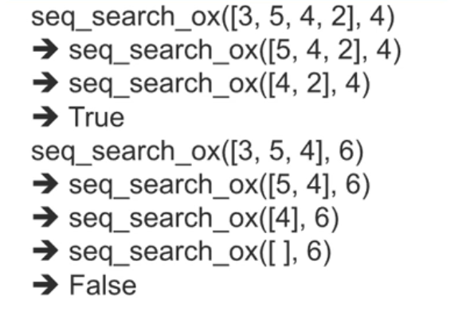

1. Searching
2. 리스트 검색: OX문제 (있는지 없는지 알려주는 형태)
3. 리스트 검색: 찾은 위치를 알려주지 (요소가 리스트 내에서 어디에 있는지)
4. 문자열 검색: 파일 입출력
5. 문자열 검색: 텍스트 파일에서 문자열 검색

# Searching

index라는 내장함수를 사용하면 인덱스 번호를 리턴해줌

s.index(x)
s.index(x, i) i위치부터 시작해서 가장 먼저 만나는 x의 인덱스 리턴
s.index(x, i, j) i부터 j앞까지 내에서 가장 먼저 만나는 x의 인덱스 리턴

## Random 샘플 생성

표준 라이브러리에서 제공하는 random 모듈 사용

random.sample(population, k)
random.sample(range(10000), 1000)
0 ~ 9999 사이의 만개의 정수 중에서 무작위로 1000개를 중복없이 뽑아 리스트를 생성

```py
import random
db = random.sample(range(10000), 1000)
key = db[109]
print(db.index(key))
```

인덱스에 없는 데이터를 검색하면 ValueError

안전 코딩

```py
if key in db:
  db.index(key)
```

# 리스트 검색: XO문제

key가 list s에 있는가?에 대답할 수 있는 함수
input: list s & key
return: if k is in s: True, else: False

- 검색 방법
  - 순차 검색 sequential search
  - 이분 검색binary search

## 순차검색

앞에서부터 하나씩 차례로 검색

반복 조건

- s의 첫번째 원소 s[0] == key 이면 True,
- 아니면 그 다음 원소부터 s[1:] key를 재귀로 찾음

종료 조건

- s == [] 검색대상이 없으므로 False


